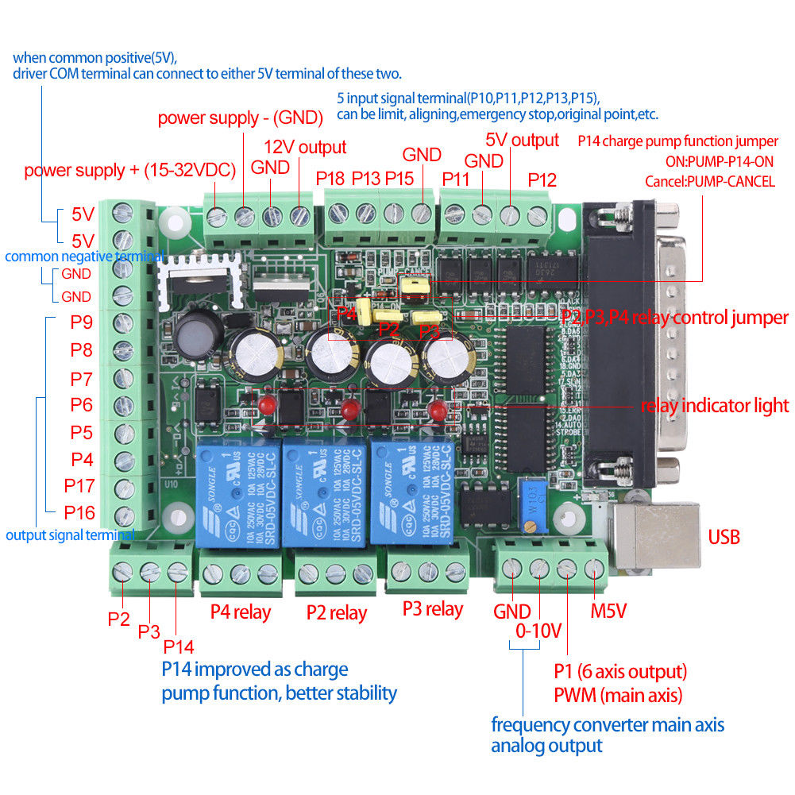

# 7I76_7I85S_MACH3B1_MACH3B2 pinout

## DB25-P1

[read 7I76 manual](http://www.mesanet.com/pdf/parallel/7i76man.pdf)

|SOC-DB25 PIN | 7I76 P1 PIN | HM2 I/O |  FUNCT   |
|:-----------:|:-----------:|:-------:|:--------:|
| 1           |  1          |  00     | DIR0     |
| 2           |  2          |  02     | DIR1     |
| 3           |  3          |  04     | DIR2     |
| 4           |  4          |  06     | DIR3     |
| 5           |  5          |  08     | DIR4     |
| 6           |  6          |  09     | STEP4    |
| 7           |  SS0TX      |  10     | OUT      |
| 8           |  SS0RX      |  11     | IN       |
| 9           |  SS1TX      |  12     | OUT      |
| 10          |  SS1RX      |  13     | IN       |
| 11          |  11         |  14     | ENCI     |
| 12          |  12         |  15     | ENCB     |
| 13          |  13         |  16     | ENCA     |
| 14          |  14         |  01     | STEP0    |
| 15          |  15         |  03     | STEP1    |
| 16          |  16         |  05     | STEP2    |
| 17          |  17         |  07     | STEP3    |
| 18          |  18         |         | GND      |
| 19          |  19         |         | GND      |
| 20          |  20         |         | GND      |
| 21          |  21         |         | GND      |
| 22          |  22         |         | GND/5V   |
| 23          |  23         |         | GND/5V   |
| 24          |  24         |         | GND/5V   |
| 25          |  25         |         | GND/5V   |

## DB25-P2

[read 7I85S manual](http://www.mesanet.com/pdf/parallel/7i85sman.pdf)

## DB25-P3

mapped to cheap but powerful chinese bob 

|SOC-DB25 PIN | MACH3B1 PIN | HM2 I/O |  FUNCT   |
|:-----------:|:-----------:|:-------:|:--------:|
| 1           |  P1         |  34     | SPL PWM  |
| 2           |  P2         |  36     | SPL ENA  |
| 3           |  P3         |  38     | OUT/RELAY|
| 4           |  P4         |  40     | DIR1     |
| 5           |  P5         |  42     | STEP1    |
| 6           |  P6         |  43     | DIR2     |
| 7           |  P7         |  44     | STEP2    |
| 8           |  P8         |  45     | DIR3     |
| 9           |  P9         |  46     | STEP3    |
| 10          |  P10        |  47     | INPUT    |
| 11          |  P11        |  48     | ENCA     |
| 12          |  P12        |  49     | ENCB     |
| 13          |  P13        |  50     | ENCZ     |
| 14          |  P14        |  35     | SPL DIR  |
| 15          |  P15        |  37     | INPUT    |
| 16          |  P16        |  39     | OUTPUT   |
| 17          |  P17        |  41     | OUTPUT   |
| 18          |  GND        |         | GND      |
| 19          |  GND        |         | GND      |
| 20          |  GND        |         | GND      |
| 21          |  GND        |         | GND      |
| 22          |  GND        |         | GND      |
| 23          |  GND        |         | GND      |
| 24          |  GND        |         | GND      |
| 25          |  GND        |         | GND      |

## DB25-P4

|SOC-DB25 PIN | MACH3B1 PIN | HM2 I/O |  FUNCT   | SUGGESTION     |
|:-----------:|:-----------:|:-------:|:--------:|:--------------:|
| 1           |  P1         |  51     | SPL PWM  | spindle speed  |
| 2           |  P2         |  53     | SPL ENA  | spindle enable |
| 3           |  P3         |  55     | OUT/RELAY|                |
| 4           |  P4         |  57     | DIR1     | x axis dir     |
| 5           |  P5         |  59     | STEP1    | x axis step    |
| 6           |  P6         |  60     | DIR2     | y axis dir     |
| 7           |  P7         |  61     | STEP2    | y axis step    |
| 8           |  P8         |  62     | DIR3     | z axis dir     |
| 9           |  P9         |  63     | STEP3    | z axis step    |
| 10          |  P10        |  64     | INPUT    | x axis stop    |
| 11          |  P11        |  65     | INPUT    | y axis stop    |
| 12          |  P12        |  66     | INPUT    | z axis stop    |
| 13          |  P13        |  67     | INPUT    | z calibration  |
| 14          |  P14        |  52     | SPL DIR  | spindle dir    |
| 15          |  P15        |  54     | INPUT    | alarm          |
| 16          |  P16        |  56     | OUTPUT   |                |
| 17          |  P17        |  58     | OUTPUT   |                |
| 18          |  GND        |         | GND      |                |
| 19          |  GND        |         | GND      |                |
| 20          |  GND        |         | GND      |                |
| 21          |  GND        |         | GND      |                |
| 22          |  GND        |         | GND      |                |
| 23          |  GND        |         | GND      |                |
| 24          |  GND        |         | GND      |                |
| 25          |  GND        |         | GND      |                |
